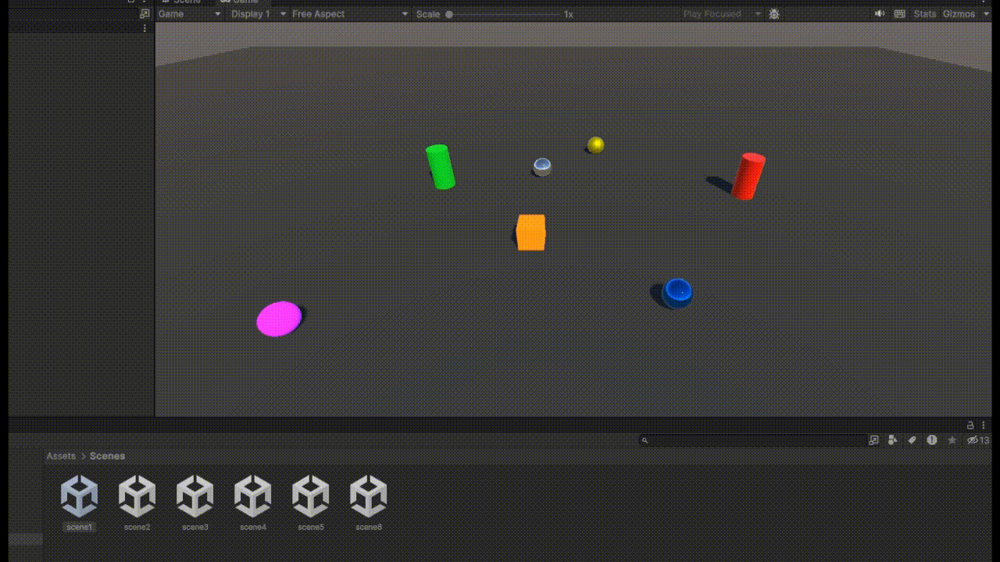
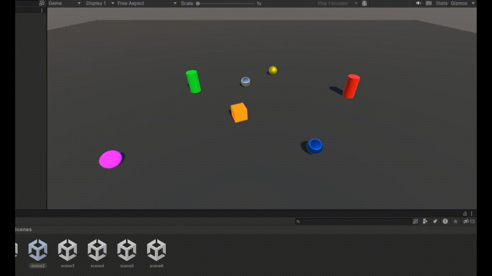
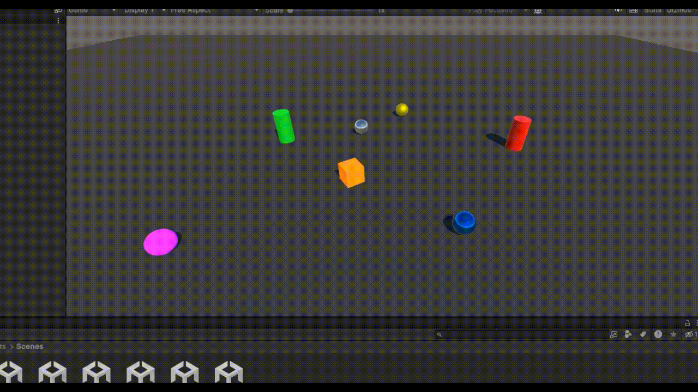
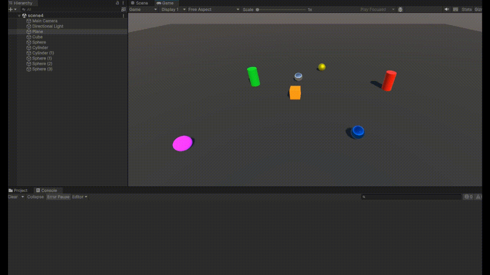
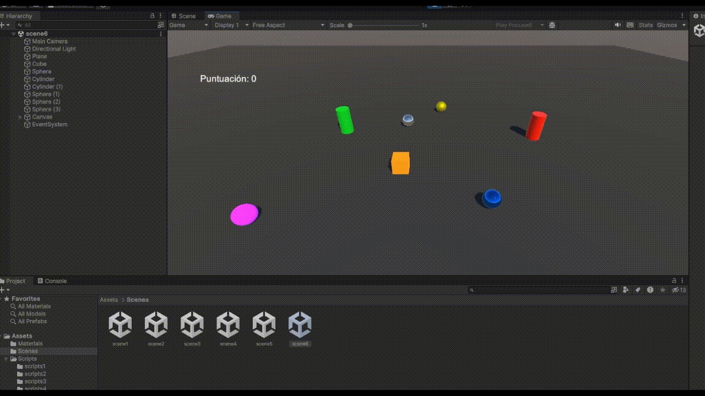

# Delegados, eventos y UI
## Práctica 3 - Interfaces Inteligentes 

En este repositorio se encuentra el cuarto proyecto en Unity de la asignatura de Interfaces Inteligentes, en él, se debían crear varias escenas con objetos para realizar diferentes objetivos a través de scripts y el uso de delegados, eventos y ui

El primer ejercicio pedía crear una mecánica que hiciese que las esferas de tipo 1 cambiaran su color y que las de tipo 2 se desplazasen hacia el cilindro cuando un cubo colisiona con un cilindro

En la segunda escena que se pedía, se debía de realizar otra mecánica en la cual si el cubo colisionaba con esferas del grupo 1, las esferas del grupo 2 aumentan de tamaño y si colisionaba con otra cosa, las esferas del grupo 1 se acercan al cilindro.

La tercera pregunta pedía cambiar las esferas de color del grupo 1 y que saltasen y que se orientase a las esferas del grupo 2 hacia una esfera de grupo 1 dependiendo de la colisión del cubo

La cuarta escena incluye un sistema de puntuación en el que el cubo puede recoger las esferas y dependiendo de su grupo, atribuyen más o menos puntos al cubo

En el penúltimo ejercicio se pedía añadir una interfaz para mostrar la puntuación del ejercicio anterior

![scene5][img/scene5.gif]

Y por último, en un ejercicio con elementos opcionales a elegir, decidí hacer que además de lo anterior, el cubo pueda coger un cilindro para aumentar su tamaño, aumentar su velocidad y cambiar de color

